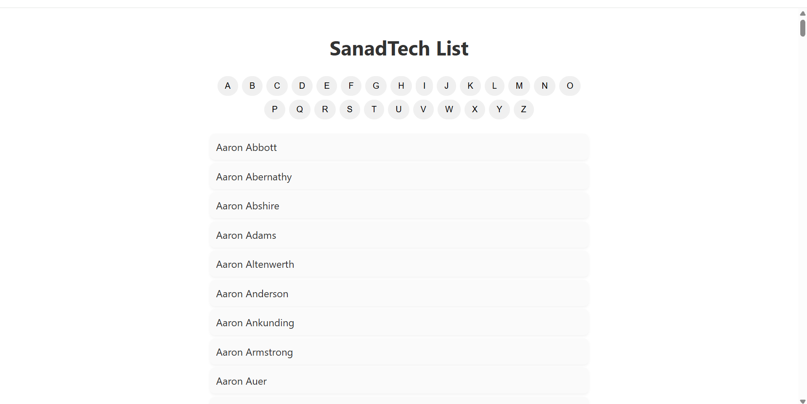

Technical Test - SanadTech 

Full Name: ELBAKIR Bassam
SUBJECT(4): QA-Automatisation des tests.

# Key features:

1. Alphabet menu for filtering users by first letter

2. Infinite scroll to load users dynamically

3. “Not Available” message for letters with no users

4. Responsive and lightweight frontend design

# The project demonstrates efficient handling of large datasets with modern frontend and backend technologies:

# Frontend: 
React.js

# Backend: 
Node.js + Express

# Data storage: 
(users.txt)

#     Setup Instructions

1. Clone the repository
git clone https://github.com/XxBssxX/SanadTech-Test-ELBAKIR_Bassam.git
cd sanadtech-test

2. Backend Setup
cd backend
npm install
node server.js

Test backend:
http://localhost:5000/users?letter=A&page=1&limit=100

3. Frontend Setup
cd frontend
npm install
npm start

Test frontend: http://localhost:3000

#   The steps to test the APP

1. Open the app in your browser.

# This is what you will see:

   

2. Click any alphabet button to filter users by first letter.

3. Scroll down to load more users automatically.

- If no users exist for a selected letter, “Not Available” will be displayed.

#  Explanation of the logic in this app:

This application handles large datasets efficiently using a combination of pagination, infinite scroll, and smart rendering:

1. Pagination: Users are loaded in small batches to prevent browser freezing.

2. Infinite Scrolling: Additional users are fetched only when the user scrolls to the bottom of the list. This is implemented using an IntersectionObserver, which automatically triggers fetching the next batch.

- Dynamic State Management:

"The app keeps track of loaded users, current page, and letters with no users."

"Letters with no users immediately show “Not Available”."

"Additional pages are loaded only if more data exists."

3. Efficient Rendering:

- Only new users are appended to the list instead of re-rendering the entire dataset.

- Loader and “Not Available” messages are conditionally rendered to improve UX.

#   Result: 
The frontend remains smooth and responsive even for letters with hundreds or thousands of users, making this approach suitable for real-world applications.